# Cashonrails DevOps / Platform Engineering Assessment

## Overview

Production-shaped Laravel payment platform built with Terraform, AWS, Kubernetes, Helm, Argo CD, GitHub Actions, and security/observability controls.

The platform was fully validated on AWS staging. Huawei Cloud was the target cloud; account activation was unavailable during the assessment window.

- **Staging on AWS**: live, deployed via GitOps, reachable over HTTPS.
- **Production**: not deployed.
- **Huawei Cloud**: Terraform scaffolding included, not applied to a live account.

## Architecture

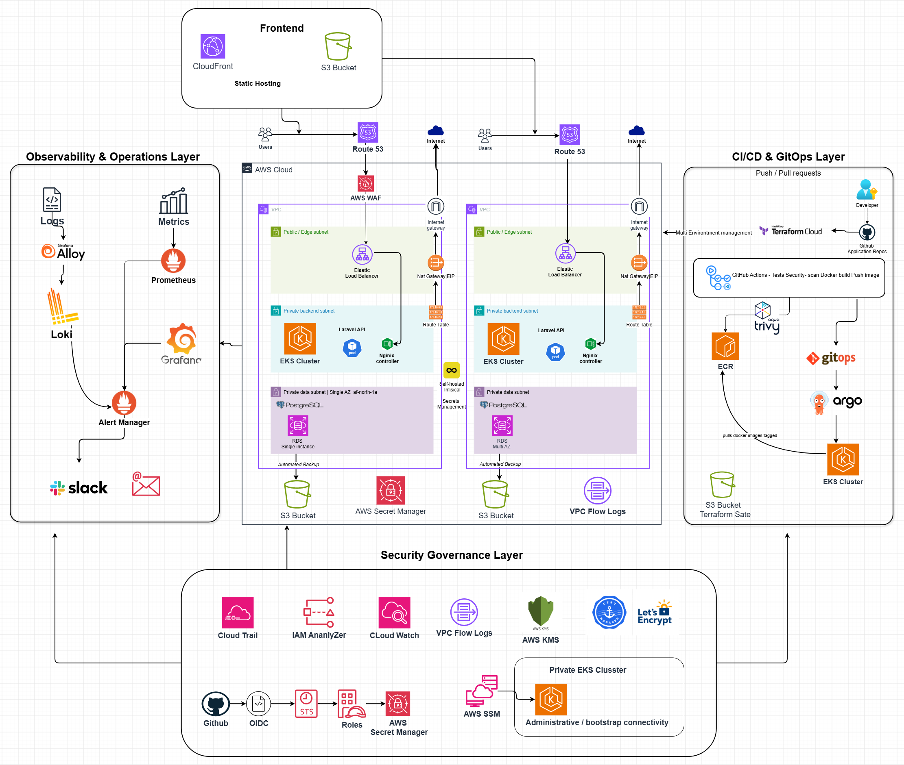

The diagram above includes both what is deployed today and the intended production target. The AWS staging environment deployed and validated in this assessment is the functional-validation subset: a private EKS cluster behind a load balancer and ingress-nginx, TLS via cert-manager, private RDS PostgreSQL, and Argo CD reconciling the cluster against `deploy/`. The EKS API endpoint is private; administrative access is through AWS Systems Manager.

Components shown but not currently deployed (CloudFront/S3 frontend, WAF, Terraform Cloud, CloudTrail, IAM Access Analyzer, a self-hosted secrets manager, and alerting to Slack/email) represent the intended production architecture and future hardening, not the current staging build.

## Infrastructure

| Layer | Technology |
|---|---|
| Cloud | AWS (validation), Huawei Cloud (target, scaffolded) |
| Kubernetes | Amazon EKS |
| Database | PostgreSQL / RDS |
| Container Registry | Amazon ECR |
| IaC | Terraform |
| GitOps | Argo CD |
| Ingress | ingress-nginx |
| TLS | cert-manager (Let's Encrypt staging) |
| Observability | Prometheus, Grafana, Loki |
| Security | IAM, OIDC, Trivy, Secrets Manager |

AWS environment state is stored remotely in S3 with native locking. The bootstrap root is deliberately separated because it creates the resources required by the other Terraform roots.

## CI/CD

```text
Git Push → Test → Docker Build → Trivy Scan → ECR → Argo CD → EKS
```

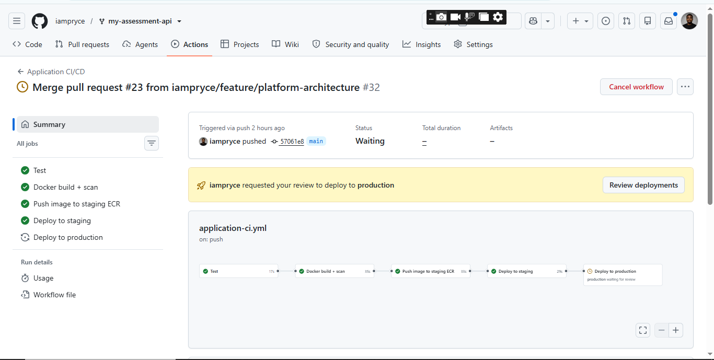

Platform infrastructure deploys in dependency order:

```text
Bootstrap → AWS Foundation → EKS → Platform Access → Platform Add-ons
```

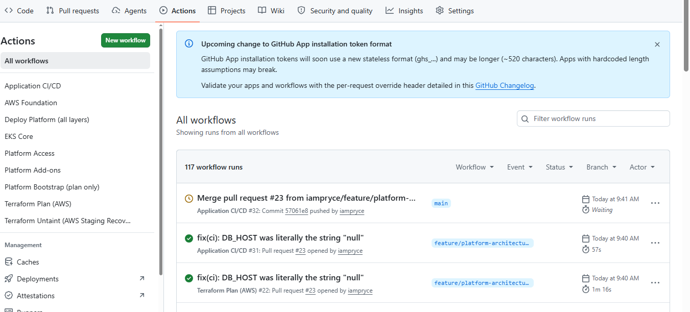

| Stage | Workflow |
|---|---|
| Bootstrap | `platform-bootstrap.yml` (plan-only in CI; applied locally) |
| Foundation | `aws-foundation.yml` |
| EKS | `eks-core.yml` |
| Platform Access | `platform-access.yml` |
| Platform Add-ons | `platform-addons.yml` |

## Platform Engineering

The platform is designed to support additional services without rebuilding the underlying infrastructure.

A new service can reuse:

- Terraform infrastructure modules
- EKS platform services
- Argo CD GitOps patterns
- CI/CD pipeline structure
- Ingress and TLS configuration
- Observability components

For example, a new team's Go payment service would provide its own container, Helm chart, Argo CD Application manifest, and CI workflow while consuming the existing platform.

## Security

- GitHub OIDC with short-lived AWS credentials
- Separate IAM roles for planning, infrastructure deployment, application CI/CD, and platform operations
- Private EKS API endpoint
- Terraform-managed EKS access entries
- AWS Secrets Manager for database credentials
- Environment-scoped GitHub secrets
- Production environment approval gate
- Trivy HIGH/CRITICAL vulnerability gate with four scoped, expiring exceptions

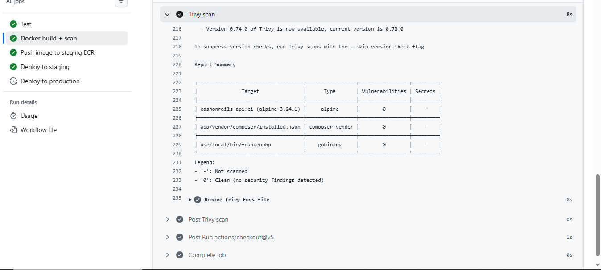

## Observability

- Prometheus
- Grafana
- Loki
- VPC Flow Logs

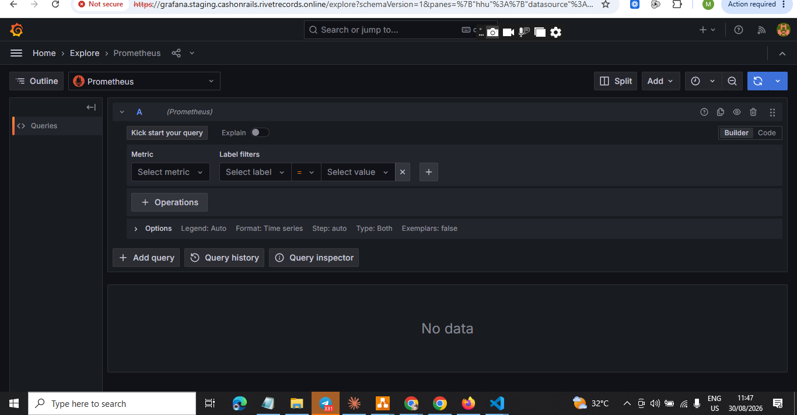

Staging services:

- Application: [https://api.staging.cashonrails.rivetrecords.online](https://api.staging.cashonrails.rivetrecords.online)
- Argo CD: [https://argocd.staging.cashonrails.rivetrecords.online](https://argocd.staging.cashonrails.rivetrecords.online)
- Grafana: [https://grafana.staging.cashonrails.rivetrecords.online](https://grafana.staging.cashonrails.rivetrecords.online)

Administrative access details: [`docs/ADMIN_ACCESS.md`](docs/ADMIN_ACCESS.md).

## Data Residency

The assessment specifies that designated customer and transaction data should remain in Nigeria. The AWS environment is used for functional validation only and no data-residency claim is made for the AWS deployment.

The Huawei Cloud design is intended to satisfy the target residency requirement once the required account is available.

## Deployment

### Prerequisites

- AWS CLI v2
- Terraform `>= 1.15.0, < 2.0.0`
- `kubectl`
- `session-manager-plugin`
- AWS/GitHub OIDC roles created by `terraform/aws/bootstrap`

### Platform Deployment

The platform is deployed in dependency order:

```text
Bootstrap
   ↓
AWS Foundation
   ↓
EKS Core
   ↓
Platform Access
   ↓
Platform Add-ons
```

`deploy-platform.yml` orchestrates the four platform layers after bootstrap.

### Application Deployment

Changes pushed to `main` follow:

```text
Test → Build → Trivy Scan → ECR → Argo CD → EKS
```

Staging deployment is automatic after the pipeline passes.

Production requires explicit GitHub Environment approval and was not deployed.

## Validation

- Terraform `fmt` / `validate`: pass
- AWS Foundation: successfully applied
- EKS Core: successfully applied
- Platform Access: successfully applied
- Platform Add-ons: successfully applied
- CI tests and code style: pass
- Trivy scan: pass
- Argo CD: synced and healthy
- Staging application: live over HTTPS

### Platform validation

| Foundation | EKS Core | Platform Access | Platform Add-ons |
|---|---|---|---|
| 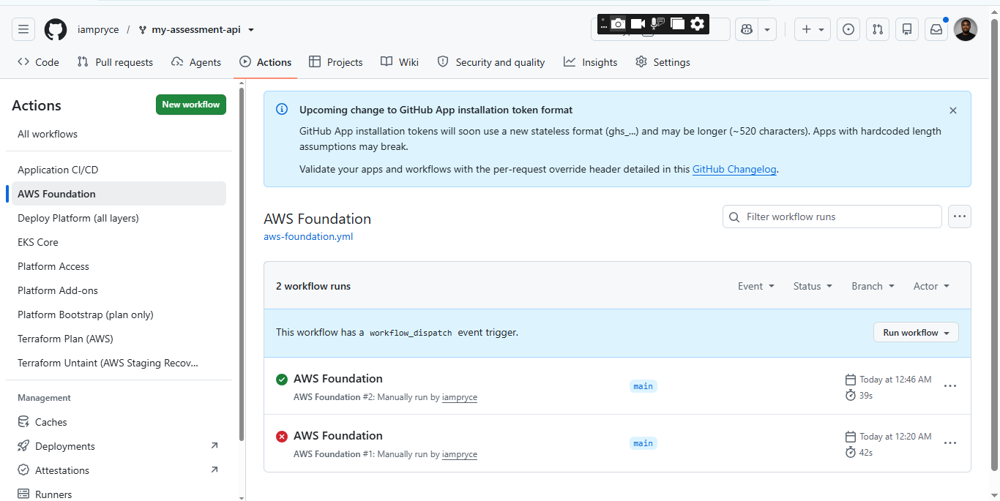 | 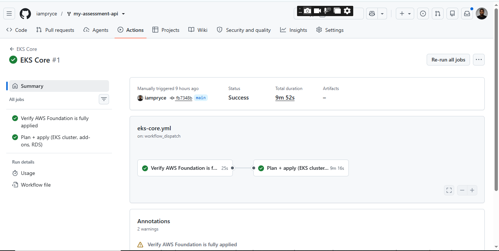 | 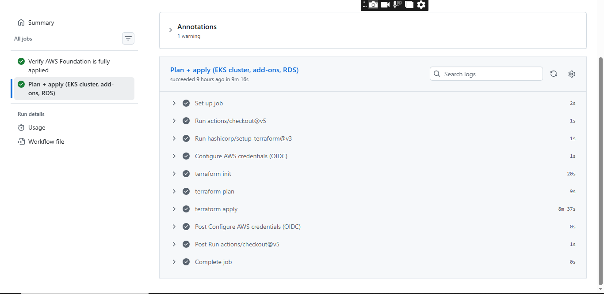 | 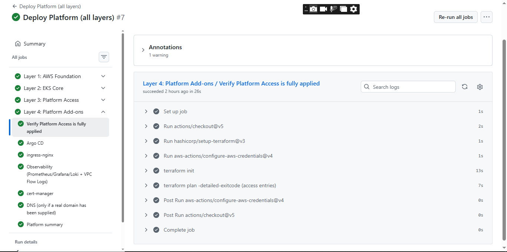 |

### Argo CD

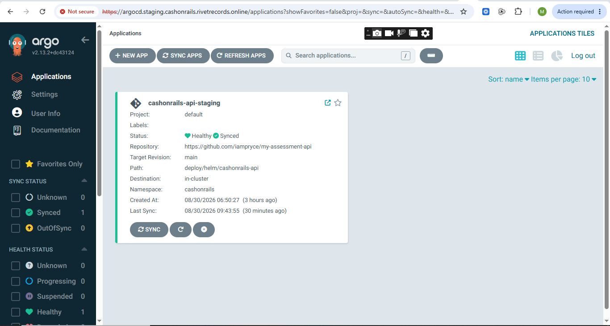

### Staging application

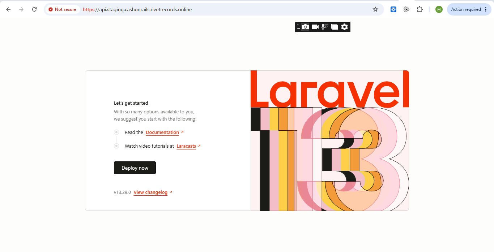

## Known Limitations

- Huawei Cloud was not deployed because account activation was unavailable during the assessment.
- Production was not deployed.
- Certificates use Let's Encrypt staging ACME, so browsers may display an untrusted-certificate warning.
- Prometheus alert rules are not configured.
- RDS Multi-AZ is disabled and backup retention is one day.
- No application-level metrics endpoint or autoscaling is configured.
- No disaster-recovery drill was performed.
- A separate detailed data-residency document is not currently included in the repository.

## Production Improvements

- Apply the Huawei Cloud Terraform once account activation is available.
- Switch cert-manager to Let's Encrypt production ACME.
- Enable RDS Multi-AZ and increase backup retention.
- Add Prometheus alerting, application metrics, and horizontal pod autoscaling.
- Perform and document a backup-restore/disaster-recovery drill.

## Destroy

Destroy platform resources before the underlying AWS infrastructure:

```bash
cd terraform/aws/envs/staging/platform
terraform init -backend-config="bucket=<state-bucket-name>"
terraform destroy

cd ..
terraform init -backend-config="bucket=<state-bucket-name>"
terraform destroy
```

Repeat for `production` if it has been deployed.

Do not destroy `terraform/aws/bootstrap` unless the entire AWS foundation is intentionally being decommissioned.

## Project Structure

```text
app/                    Laravel application
deploy/                 Helm chart + Argo CD Application manifests
terraform/aws/          AWS infrastructure
terraform/huawei/       Target-cloud Terraform scaffolding
.github/workflows/      CI/CD pipelines
docs/                   Architecture and deployment evidence
```

## Conclusion

The platform was implemented and validated end-to-end on AWS staging, with infrastructure as code, dependency-gated platform deployment, GitOps application delivery, security controls, and observability in place.

The remaining target-cloud work is applying the Huawei Cloud Terraform once the required account is available.
